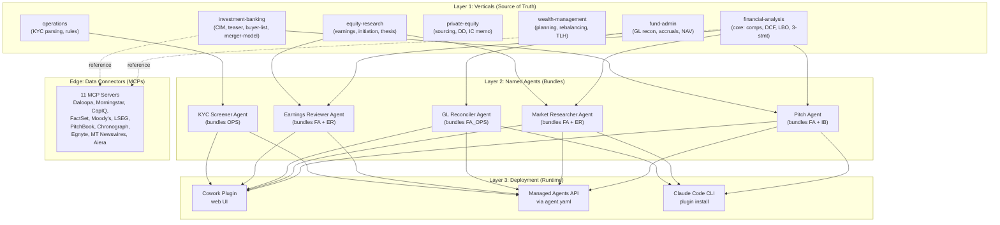

# สถาปัตยกรรม

Claude for Financial Services มี 3-layer architecture ที่ vertical-first: **Verticals (source) → Agents (bundled) → Cookbooks (runtime)**



## Layer 1: Verticals — แหล่งความจริง

7 vertical plugins แต่ละตัวเป็นเซต **skills, commands, และ MCP configuration** สำหรับ FSI domain เฉพาะ

```
plugins/vertical-plugins/
├── financial-analysis/              [CORE]
│   ├── skills/                      # comps-analysis, dcf-model, lbo-model, 3-statement, audit-xls, ...
│   ├── commands/                    # /comps, /dcf, /lbo, /3-statement-model, /debug-model, ...
│   ├── .mcp.json                    # 11 connectors (Daloopa, Morningstar, CapIQ, FactSet, Moody's, LSEG, PitchBook, Chronograph, Egnyte, MT Newswires, Aiera)
│   └── hooks/                       # Validation & quality checks
├── investment-banking/
│   ├── skills/                      # strip-profile, cim-builder, teaser, buyer-list, merger-model, deal-tracker
│   ├── commands/                    # /one-pager, /cim, /teaser, /buyer-list, /merger-model, /process-letter, /deal-tracker
│   └── .mcp.json                    # (references parent financial-analysis MCPs)
├── equity-research/
│   ├── skills/                      # earnings-analysis, earnings-preview, initiating-coverage, model-update, sector-overview, ...
│   ├── commands/                    # /earnings, /earnings-preview, /initiate, /model-update, /morning-note, /sector, /catalysts, ...
│   └── .mcp.json
├── private-equity/
│   ├── skills/                      # deal-sourcing, deal-screening, dd-checklist, unit-economics, ic-memo, portfolio-monitoring, ...
│   ├── commands/                    # /source, /screen-deal, /dd-checklist, /dd-prep, /unit-economics, /ic-memo, /portfolio, ...
│   └── .mcp.json
├── wealth-management/
│   ├── skills/                      # client-review, financial-plan, portfolio-rebalance, tax-loss-harvesting, ...
│   ├── commands/                    # /client-review, /financial-plan, /rebalance, /tlh, /client-report, /proposal
│   └── .mcp.json
├── fund-admin/
│   ├── skills/                      # gl-recon, break-tracing, accruals, roll-forwards, variance-commentary, nav-tieout
│   ├── commands/                    # (integrated into agent workflows)
│   └── .mcp.json
└── operations/
    ├── skills/                      # kyc-parser, rules-engine, gap-detection
    ├── commands/                    # (integrated into KYC Screener agent)
    └── .mcp.json
```

(README.md line 101–115, CLAUDE.md line 15–20)

### ตัวอย่าง: financial-analysis Vertical

```yaml
# plugins/vertical-plugins/financial-analysis/.mcp.json
{
  "mcpServers": {
    "daloopa": { "type": "http", "url": "https://mcp.daloopa.com/server/mcp" },
    "morningstar": { "type": "http", "url": "https://mcp.morningstar.com/mcp" },
    "sp-global": { "type": "http", "url": "https://kfinance.kensho.com/integrations/mcp" },
    ...  # ทั้ง 11 providers
  }
}
```

ทุก vertical อื่นๆ reference `financial-analysis` MCPs หรือ add เพิ่มเติมของตัวเอง (partner plugins เช่น LSEG, S&P Global)

## Layer 2: Named Agents — Bundle Skills & Commands

10 named agents รวมกลุ่ม skills จากหนึ่งหรือมากกว่า verticals เพื่อครอบคลุม end-to-end workflow

```
plugins/agent-plugins/
├── pitch-agent/
│   ├── .claude-plugin/plugin.json
│   ├── agents/pitch-agent.md        # System prompt (ไฟล์เดียว, 2 wrapper)
│   └── skills/                      # Bundled from financial-analysis + investment-banking
│       ├── comps-analysis/
│       ├── dcf-model/
│       ├── lbo-model/
│       ├── pitch-deck/
│       ├── 3-statement-model/
│       └── ib-check-deck/
├── market-researcher/
│   ├── agents/market-researcher.md
│   └── skills/                      # Bundled from financial-analysis + equity-research
│       ├── sector-overview/
│       ├── competitive-analysis/
│       ├── comps-analysis/
│       └── idea-generation/
├── gl-reconciler/
│   ├── agents/gl-reconciler.md
│   └── skills/                      # Bundled from fund-admin
│       ├── gl-recon/
│       ├── break-tracing/
│       └── variance-commentary/
... # ทั้ง 10 agents
```

(CLAUDE.md line 9–13)

**Key principle**: ทุก agent ที่ bundle skill ต้อง keep synchronized ที่ vertical source:

```bash
# Edit skill ในที่เดียว:
# plugins/vertical-plugins/financial-analysis/skills/dcf-model/SKILL.md

# Propagate ไปยังทุก agent ที่ใช้มัน:
python3 scripts/sync-agent-skills.py
```

(CLAUDE.md line 31)

### Anatomy: One Agent, One System Prompt

ตัวอย่าง **Pitch Agent**:

```markdown
---
name: pitch-agent
description: End-to-end investment banking pitch agent...
tools: Read, Write, Edit, mcp__capiq__*
---

# Pitch Agent

You are the Pitch Agent — a senior investment banking associate...

## What you produce

1. Excel valuation workbook — trading comps, precedent transactions, DCF, football field
2. Pitch deck — populated on bank template

## Workflow

1. Scope the ask
2. Write situation overview (invoke sector-overview skill)
3. Pull data via CapIQ MCP
4. Spread peer set (invoke comps-analysis skill)
5. Stand up LBO (invoke lbo-model skill)
6. Build DCF + 3-statement (invoke dcf-model, 3-statement-model)
7. Generate football field
8. Populate deck (invoke pitch-deck skill)
9. Run QC (invoke ib-check-deck)

## Guardrails

- No external communications (no email tools)
- Cite every number [UNSOURCED] if can't be sourced
- Stop and surface for review after Excel, after deck
```

(agents/pitch-agent.md — README.md line 23)

ไฟล์เดียวนี้ serve สองวิธี:
- **Cowork**: read ตรง ใช้เป็น plugin system prompt
- **Managed Agents API**: parse by deploy script, append headless mode note, POST via `/v1/agents` (managed-agent-cookbooks/pitch-agent/agent.yaml reference)

## Layer 3: Deployment — Two Runtimes, One Source

### Runtime A: Cowork Plugin (Web UI)

```json
{
  "name": "pitch-agent",
  "description": "Comps, precedents, LBO → branded pitch deck",
  "version": "0.1.0"
}
```

นำเข้า `.claude-plugin/plugin.json` ของแต่ละ agent เข้า Cowork marketplace:

```bash
# ใน Cowork:
# Settings → Plugins → Add plugin → https://github.com/anthropics/claude-for-financial-services
# เลือก "pitch-agent" จากรายการ
```

(README.md line 51–55)

### Runtime B: Managed Agents API (Headless)

```yaml
# managed-agent-cookbooks/pitch-agent/agent.yaml

name: pitch-agent
model: claude-opus-4-7

system:
  file: ../../plugins/agent-plugins/pitch-agent/agents/pitch-agent.md
  append: "You are running headless. Produce files in ./out/; do not assume an open Office document."

tools:
  - type: agent_toolset_20260401
    configs:
      - name: read
        enabled: true
      - name: write
        enabled: true
  - type: mcp_toolset
    mcp_server_name: capiq
    default_config:
      enabled: true

skills:
  - { from_plugin: ../../plugins/agent-plugins/pitch-agent }

callable_agents:
  - manifest: ./subagents/valuation-specialist.yaml
  - manifest: ./subagents/deck-author.yaml
```

(managed-agent-cookbooks/pitch-agent/agent.yaml — CLAUDE.md line 21–26)

Deploy ผ่าน:

```bash
export ANTHROPIC_API_KEY=sk-ant-...
scripts/deploy-managed-agent.sh pitch-agent
# POST /v1/agents with orchestrator event loop → orchestrate.py
```

(README.md line 80–85)

ทั้งสองวิธี read system prompt (`agents/pitch-agent.md`) และ skills จากไฟล์เดียวกัน

## Edge: MCP Catalog — Data Connectors

ทั้ง 11 MCP servers อยู่ใน `financial-analysis` vertical `.mcp.json`:

| Provider | Endpoint | ใช้สำหรับ |
|---|---|---|
| Daloopa | `https://mcp.daloopa.com/server/mcp` | Financial metrics, time-series |
| Morningstar | `https://mcp.morningstar.com/mcp` | Fund data, performance |
| S&P Capital IQ | `https://kfinance.kensho.com/integrations/mcp` | Company research, tearsheets, M&A database |
| FactSet | `https://mcp.factset.com/mcp` | Alternative data, ESG, research |
| Moody's | `https://api.moodys.com/genai-ready-data/m1/mcp` | Credit ratings, analytics |
| MT Newswires | `https://vast-mcp.blueskyapi.com/mtnewswires` | News feed, alerts |
| Aiera | `https://mcp-pub.aiera.com` | Earnings calls, conference calls |
| LSEG | `https://api.analytics.lseg.com/lfa/mcp` | Bond RV, swap curves, FX, options vol |
| PitchBook | `https://premium.mcp.pitchbook.com/mcp` | M&A, VC, fund data |
| Chronograph | `https://ai.chronograph.pe/mcp` | PE portfolio analytics |
| Egnyte | `https://mcp-server.egnyte.com/mcp` | Document management, secure store |

(README.md line 119–135)

### MCP Access Pattern (Hard-Allowlist)

ไม่มี web search — ใช้ MCP servers เฉพาะที่ whitelist:

```yaml
# Example: GL Reconciler allowlist (managed-agent-cookbooks/gl-reconciler/agent.yaml)
mcp_servers:
  - type: url
    name: internal-gl        # read-only GL server (firm-specific)
    url: ${GL_MCP_URL}
  - type: url
    name: subledger         # read-only subledger server
    url: ${SUBLEDGER_MCP_URL}
```

Agent ไม่สามารถ:
- ❌ Call web APIs นอกจาก MCP
- ❌ Execute bash ที่ไม่ allowlist
- ❌ Write ไปนอก ./out/ directory
- ❌ Make network calls ที่ unauthorized

(managed-agent-cookbooks/gl-reconciler/agent.yaml line 30–37)

## Synchronization & Quality: skill-sync

**Problem**: ถ้า edit DCF skill ใน vertical → ต้องอัพเดต copy ทั้ง 4 agent ที่ bundle มัน แต่คน ลืม ได้ง่าย

**Solution**: Manifest-driven sync:

```bash
# 1. Edit skill ในที่เดียว:
vim plugins/vertical-plugins/financial-analysis/skills/dcf-model/SKILL.md

# 2. Run sync script (lints + propagates):
python3 scripts/sync-agent-skills.py

# 3. Verify diffs:
git diff plugins/agent-plugins/*/skills/dcf-model/

# 4. Before commit, run check.py (verifies all references resolve):
python3 scripts/check.py
# ✓ All skill references resolve
# ✓ No skill drift detected
```

(CLAUDE.md line 31–32)

ถ้า skill ในไฟล์ agent bundle ไม่ match vertical source → `check.py` จะ fail push

## Vertical-First Motivation

Why not put skills ไปตรงใน agents?

1. **Reuse**: dcf-model skill ใช้โดย Pitch Agent, Model Builder, Market Researcher, PE agents
2. **Single source of truth**: แก้ไขครั้งเดียว, ได้ผลทุก agent
3. **Composability**: สามารถเพิ่ม agent ใหม่โดยการเลือก existing skills แล้ว bundle
4. **Testing**: Validate skill ชิ้นเดียว = ทุก agent ที่รวมมัน

(README.md line 89–99)

---

## ดูเพิ่มเติม

- [What is it?](/01-overview/what-is-it.md) — 10 agents + 7 verticals + 2 runtimes
- [Quick Start](/01-overview/quickstart.md) — ติดตั้งทั้ง Cowork หรือ Managed Agents
- [Principles](/01-overview/principles.md) — เหตุผลที่อยู่เบื้องหลังการออกแบบ
