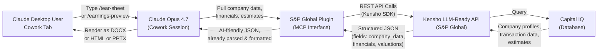

# S&P Global Plugin

## S&P Global คือใคร

**S&P Global** (ผ่าน Kensho Technologies) เป็นผู้ให้บริการข้อมูลการเงิน การให้คะแนน และข้อมูลความเสี่ยงชั้นนำของโลก บริษัทนี้รู้จักกันจากผลิตภัณฑ์หลัก:

- **Capital IQ** — ฐานข้อมูลบริษัท, ข้อมูลการทำธุรกรรม (M&A, venture, private equity), ประมาณการนักวิเคราะห์, earnings transcripts
- **S&P Global Ratings** — คะแนนสินเชื่อ (credit ratings), ความเสี่ยง, outlook ของตลาด
- **Market Intelligence** — ข้อมูลการทำธุรกรรม, ข้อมูลแข่งขัน, trends ตลาด

S&P Global Plugin สร้างโดย Kensho (S&P Global's AI unit) นำเสนอ skills ที่ออกแบบมาสำหรับ AI agents ซึ่งให้ข้อมูล real-time และเครื่องมือสร้าง documents

## ผลิตภัณฑ์และความสามารถ

Plugin นี้มี 3 skills หลัก ที่ออกแบบมาสำหรับ financial professionals:

### 1. Tear Sheet (Company Snapshot) — `tear-sheet` Skill

**ตัวอย่างการใช้**: `"Generate a business development tearsheet for Palantir"`

**ทำอะไร**: สร้างเอกสาร Word ขนาด 1-2 หน้า สำหรับบริษัทเฉพาะ โดยใช้ข้อมูล live จาก Capital IQ

**ประเภท Tear Sheet (4 audience types)**:

| Audience | ใช้สำหรับ | ตัวอย่างเนื้อหา |
|----------|--------|---|
| **Equity Research** | Analysts evaluating investment | 3-year financials, valuation multiples, consensus estimates, rating summary |
| **Investment Banking / M&A** | Bankers profiling company in transaction context | Business overview, deal relevance, M&A precedents, synergy angles |
| **Corporate Development** | Internal strategic teams evaluating acquisition target | Product/service overview, strategic fit, integration considerations |
| **Sales / Business Development** | Commercial teams preparing for client meeting | Company overview, customer base, partnership opportunities, conversation starters |

**ตัวอย่างประเด็นเนื้อหา**:
- Company profile (founded, HQ, employees, sector)
- Financial snapshot (revenue, EBITDA, margins, growth rates)
- Trading multiples (P/E, EV/Revenue, price-to-book)
- Market cap, stock price, 52-week range
- Recent earnings highlights
- Strategic positioning
- Recent M&A activity (if relevant)

**Style**: Professional 1-pager with:
- Navy header banner with company name
- 2-column header table (company identifiers, financial metrics)
- Section dividers with thin rules
- Data tables with monochrome styling
- Bullet-point synthesis sections (e.g., "Strategic Fit" for IB/M&A tearsheet)
- Footer with source attribution and "AI-generated" disclaimer

### 2. Industry Transaction Summaries — `funding-digest` Skill

**ตัวอย่างการใช้**: `"Summarize recent transactions in the data infrastructure space"`

**ทำอะไร**: สรุปกิจกรรม M&A และการทำธุรกรรมล่าสุดในภาคส่วนหรือสำหรับบริษัทเฉพาะ โดยใช้ Capital IQ

**Output**: 1-page PowerPoint slide ที่มี:
- **Stat cards** (top row): ทั้ง capital deployed, # of rounds, median deal size, largest deal
- **Key takeaways** (middle): 3-5 one-liner insights (e.g., "AI infrastructure startups attracted $2.4B across 8 rounds this week — 3x prior week")
- **Top Deals Table** (bottom): ชื่อบริษัท, ประเภทการจัดหาเงิน (Series X), announced/closed dates, amount, pre-money valuation, post-money valuation, lead investors

**ใช้สำหรับ**:
- Market mapping — understand what's happening in a sector
- Pitch preparation — competitive intelligence
- Deal flow analysis — spot trends and hot sub-sectors

### 3. Earnings Preview — `earnings-preview-beta` Skill

**ตัวอย่างการใช้**: `"Give me an earnings preview for Salesforce"`

**ทำอะไร**: สร้างภาพรวมการรายงานผลลัพธ์ที่กำลังจะเกิดขึ้น รวมถึง:
- Consensus estimates (EPS, revenue, EBITDA)
- Guidance ล่าสุด
- Analyst sentiment (recent upgrades/downgrades, price targets)
- Key metrics to watch for this earnings
- Potential surprise factors

**Output**: 4-5 page HTML report ที่มี:
- Executive thesis (what matters in this print)
- Key estimates table
- Management quotes from last call
- Competitor comparison (P/E, growth)
- Revenue & margin trend charts
- Historical stock performance around earnings
- Appendix with data sources

## Integration Architecture — Mermaid Diagram



## Data Sources และ MCP Integration

Plugin นี้ใช้ **S&P Global LLM-Ready API** (ผ่าน Kensho) ซึ่งให้บริการผ่าน MCP server

### ประเภทข้อมูลที่ใช้ได้

| ประเภท | รายละเอียด | ตัวอย่าง Tools |
|--------|----------|---|
| **Company Data** | โปรไฟล์บริษัท, ข้อมูลการเงิน, ประมาณการนักวิเคราะห์ | `get_company_info()`, `get_financials()` |
| **Transaction Data** | M&A, venture financing, strategic investments | `get_precedent_transactions()`, `get_rounds_of_funding()` |
| **Earnings Data** | ประมาณการ, guidance, ผลลัพธ์ในอดีต, transcripts | `get_earnings_consensus()`, `get_guidance_history()` |
| **Market Intelligence** | ข่าวสาร, แนวโน้ม, ข้อมูลแข่งขัน, ratings changes | `get_market_sentiment()`, `get_analyst_changes()` |
| **Sector Coverage** | ข้อมูลภาคส่วน, ความเชื่อมโยง, comparable companies | `get_competitors()`, `get_sector_trends()` |

### Authentication Flow

```
┌──────────────────────────────────────────┐
│ Step 1: User clicks S&P Global Plugin    │
│         in Cowork customization panel    │
└────────────┬─────────────────────────────┘
             │
             ▼
┌──────────────────────────────────────────┐
│ Step 2: Claude prompts for              │
│         S&P Global API credentials      │
│         (or OAuth token if configured)  │
└────────────┬─────────────────────────────┘
             │
             ▼
┌──────────────────────────────────────────┐
│ Step 3: Credentials stored securely      │
│         in Claude user settings          │
└────────────┬─────────────────────────────┘
             │
             ▼
┌──────────────────────────────────────────┐
│ Step 4: Plugin makes MCP calls           │
│         with authenticated client        │
│         (Kensho LLM-Ready API via SDK)  │
└────────────┬─────────────────────────────┘
             │
             ▼
┌──────────────────────────────────────────┐
│ Step 5: Claude receives structured JSON  │
│         with financial data              │
│         (no raw HTML parsing needed)     │
└──────────────────────────────────────────┘
```

## การใช้งาน

### ติดตั้งใน Claude Desktop

1. **เปิด Cowork tab** — ที่ด้านบนของหน้าต่าง Claude Desktop
2. **คลิก "Customize with Plugins"** button
3. **ค้นหา "S&P Global"** ในรายการ Personal plugins
4. **คลิก Add** เพื่อเพิ่มเข้า workspace
5. **ยืนยันการเข้าถึง** ด้วย S&P Global credentials เมื่อได้รับพร้อมท์

### การเรียกใช้ Skills

ใน Claude Desktop, หลังจากเพิ่ม plugin:

```
You: /tear-sheet Apple for equity research

Claude: [Renders tear sheet generation skill]
        Enter company name: Apple Inc
        Select audience type: Equity Research
        ☑ Include peer comparison
        ☑ Include valuation multiples
        
        [After clicking Generate...]
        Retrieving Apple financials from Capital IQ...
        Building comparable company table (10 peers)...
        Generating document...
        
        [Output: Apple_TearSheet_EquityResearch_20260512.docx
         Ready to download]
```

### Advanced: Customization

คุณสามารถปรับแต่ง plugin สำหรับ:
- **Template preferences** — ใช้ logo บริษัท, color scheme ของบริษัท
- **Terminology** — เปลี่ยนคำศัพท์เฉพาะอุตสาหกรรม
- **Workflow** — เพิ่ม additional sections, modify section order

ทำได้โดยคลิก **Customize** button เมื่อดู plugin settings

## ข้อกำหนด (Requirements)

| รายการ | รายละเอียด |
|--------|----------|
| **S&P Global Account** | Access to [S&P Global LLM-Ready API](https://www.marketplace.spglobal.com/en/solutions/kensho-llm-ready-api) หรือ [Capital IQ Pro](https://www.spglobal.com/market-intelligence/en/solutions/products/sp-capital-iq-pro) |
| **Claude Subscription** | Claude Pro, Max, Team, หรือ Enterprise plan |
| **Desktop App** | Claude Desktop app สำหรับ macOS หรือ Windows (version 0.2.0+) |
| **Browser** | Modern browser (Chrome, Safari, Edge) for Cowork tab |

## Sample Queries และ Expected Outputs

### Query 1: Tear Sheet for Equity Research

```
User: "Can you create an equity research tear sheet for Nvidia?"

Claude:
  1. Retrieves: Company profile, 3-year financials, consensus estimates
  2. Pulls: Trading multiples (P/E, EV/Revenue, Price/Book)
  3. Fetches: Peer companies + their multiples
  4. Generates: 1-page DOCX with:
     - Valuation summary
     - Financial trend analysis
     - Peer comparison
     - Investment thesis bullets
  
Output: Nvidia_TearSheet_EquityResearch_20260512.docx (410 KB)
```

### Query 2: Deal Flow Digest for Biotech

```
User: "Give me a transaction summary for the biotech sector this week"

Claude:
  1. Identifies: Seed-stage through growth-stage biotech exits (1 week lookback)
  2. Pulls: 12 recent transactions
  3. Computes: Aggregate metrics (total raised, # rounds, avg valuation)
  4. Generates: 1-page PPTX with:
     - Stat cards (total capital, # deals, avg pre-money)
     - Key takeaways ("Immunotherapy rounds dominated; avg post-money $450M")
     - Top 6 deals table with links to Capital IQ
  
Output: DealFlowDigest_Biotech_20260512.pptx (2.1 MB)
```

### Query 3: Earnings Preview

```
User: "What should I expect from Salesforce's upcoming earnings?"

Claude:
  1. Fetches: Consensus estimates, management guidance, last earnings transcript
  2. Pulls: Analyst rating distribution, recent estimate revisions
  3. Compiles: Upcoming quarter key metrics
  4. Generates: 4-5 page HTML report with:
     - Executive thesis
     - Consensus estimates table
     - Revenue/margin trend charts
     - Competitor P/E comparison
     - Stock price + earnings dates chart
  
Output: EarningsPreview_CRM_20260512.html (600 KB, printable)
```

## ความแตกต่างจาก Vertical Plugins

**Vertical Plugins** (e.g., equity-research, investment-banking plugins):
- ออกแบบสำหรับ specific workflow เดียว
- บรรจุ skills ที่ฟังก์ชันพิเศษสำหรับ industry นั้น
- ตัวอย่าง: equity-research plugin มี skills สำหรับ screening, model building, estimate analysis

**S&P Global Plugin** (Data-centric approach):
- ออกแบบเพื่อ **access to Capital IQ data** เป็นแรกเบื้องต้น
- Skills ใช้ได้กับหลาย workflows (IB, equity research, corporate development, sales)
- Agnostic to use case — agent เลือก audience type, S&P plugin ให้ข้อมูล
- Strength: **real-time data, breadth of coverage, deep M&A transaction history**

## ข้อจำกัด (Limitations)

1. **Data freshness**: Capital IQ updates nightly (most fields) หรือ real-time (stock prices). Earnings transcripts typically available within 24 hours of call.
2. **Private company data**: Coverage is strong for VC-backed companies and announced transactions, but sparse for truly early-stage or bootstrapped companies.
3. **Historical guidance**: Guidance history goes back ~5 years. Older guidance may not be available.
4. **Geographic scope**: Capital IQ primarily covers public companies + VC/PE-tracked private companies in US, Europe, and key Asia markets. Emerging markets coverage is lighter.
5. **Segment detail**: Segment data available only for companies that disclose (SFAS 131 filers in US); private companies rarely report segments.

## Workflow Examples

### Example 1: Pre-M&A Due Diligence

```
Investment Banker preparing for target company presentation:

1. /tear-sheet Target Company for IB/M&A audience
   → Output: 1-pager with business overview, key metrics, M&A activity in sector
   
2. /transaction-summary [Target's Sector] past 3 years
   → Output: Precedent transactions, avg multiples paid, typical deal synergies
   
3. Generate pitch: [Acquirer] should acquire [Target]
   → Claude uses data from 1 & 2 to draft investment thesis
   
→ Result: 20-slide pitch deck with comparable transactions and valuation range
```

### Example 2: Quarterly Earnings Workflow

```
Equity Research Analyst covering tech sector:

1. /earnings-preview for each stock in coverage list
   → Output: 5 HTML previews (one per company) with consensus, guidance, key metrics
   
2. Summarize themes across sector
   → Claude synthesizes: "Q1 themes: AI capex, margin compression, FX headwinds"
   
3. Create earnings calendar slide
   → Claude generates: PPTX with dates, consensus estimates, key metrics table
   
→ Result: Team briefed on what to listen for in earnings calls this week
```

### Example 3: Investment Committee Preparation

```
Growth equity team evaluating a potential investment:

1. /tear-sheet Target Company for corp-dev audience
   → Output: Strategic fit, customer base, integration considerations
   
2. /peer-comparison [Target] vs. [3 comps]
   → Output: Valuation multiples table, 3-year growth rates
   
3. /precedent-analysis [Sector] -- similar-sized exits
   → Output: Exit valuations, time-to-exit, IRR benchmarks
   
→ Result: IC pack with tearsheet, comps, precedents ready for committee meeting
```

---

**เว็บไซต์**: [S&P Global LLM-Ready API](https://www.marketplace.spglobal.com/en/solutions/kensho-llm-ready-api)  
**Documentation**: [Kensho Developer Portal](https://developer.kensho.com)  
**การสนับสนุน**: contact [commercial@kensho.com](mailto:commercial@kensho.com) หรือ support@spglobal.com
