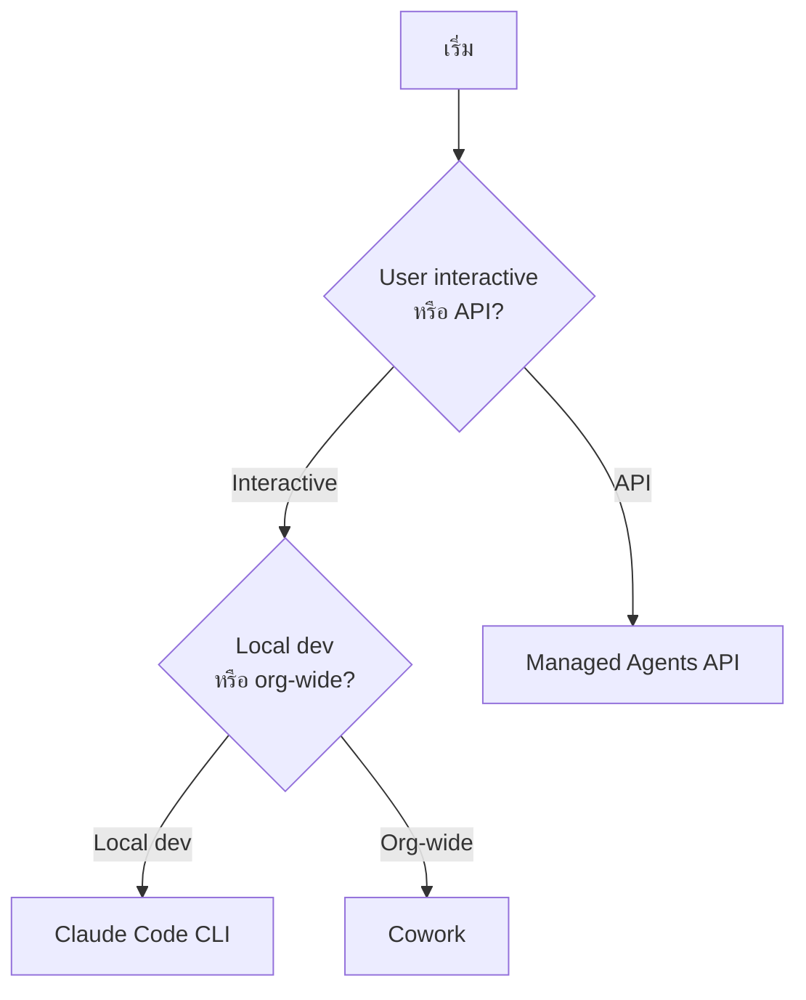

# การ Deploy

repo นี้รองรับ **3 runtime** สำหรับ deploy:

| Runtime | เหมาะกับ | Entry point |
|---------|----------|-------------|
| [Cowork (web UI)](./cowork.md) | User interactive — ติดตั้งจาก marketplace | `https://cowork.claude.com/` |
| [Claude Code CLI](./claude-code.md) | Developer — local dev | `claude plugin install <url>` |
| [Managed Agents API](./managed-agents.md) | API-driven — batch, scheduled | `POST /v1/agents` |

## เลือก runtime ยังไง?



## Single Source, Three Runtimes

นี่คือ key insight ของ repo นี้:

```
plugins/vertical-plugins/<vertical>/skills/<skill>/
       │
       ├── sync-agent-skills.py → plugins/agent-plugins/<agent>/skills/  (Cowork + Claude Code)
       │
       └── deploy-managed-agent.sh → Managed Agents API
```

**Source of truth เดียว → output 3 รูปแบบ** = ไม่ต้องเขียน skill ซ้ำ
